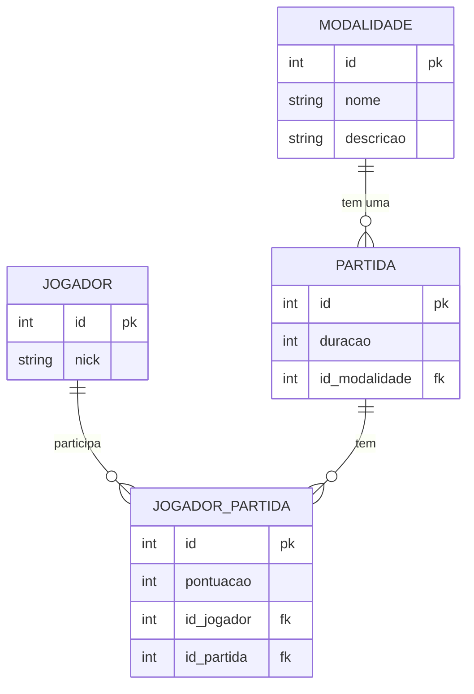

# Memory cat game
O memory cat game é um projeto desenvolvido na matéria de POO2. Seu propósito é ser um jogo da memória para passar o tempo, desafie suas habilidades de memória enquanto se diverte com diferentes modalidades de jogo.

## Tabelas usadas

## Modalidades planejadas

- Clássico

Partidas normais com cartas viradas para baixo, o jogador precisa encontrar os pares correspondentes.

- Multiplayer Competitivo

Dois jogadores competem simultaneamente para encontrar pares, com cada jogador tendo seu próprio turno.